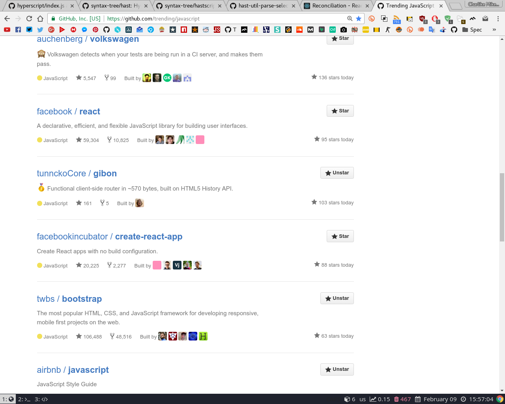

#    [![npm total downloads][downloads-img]][downloads-url]

> 

[![code climate][codeclimate-img]][codeclimate-url]
[![standard code style][standard-img]][standard-url]
[![linux build status][travis-img]][travis-url]
[![windows build status][appveyor-img]][appveyor-url]
[![coverage status][coveralls-img]][coveralls-url]
[![dependency status][david-img]][david-url]

_You might also be interested in [mitt][] - a 200 bytes event emitter, and [hyperapp][] - build rich UI apps with 1kb._

**:sparkles: Pull requests for client-side tests or any other features/fixes are welcome! :rocket:**

We are [Trending JavaScript](https://github.com/trending/javascript):

<a href="https://github.com/trending/javascript"></a>

## Table of Contents
<!-- toc -->

## Install
Install with [npm](https://www.npmjs.com/)

```
$ npm install  --save
```

or install using [yarn](https://yarnpkg.com)

```
$ yarn add 
```

Both [UMD](https://github.com/umdjs/umd) and [IIFE](https://developer.mozilla.org/en-US/docs/Glossary/IIFE) builds are also available on [unpkg](https://unpkg.com) CDN

```html
<script src="https://unpkg.com/gibon/dist/gibon.umd.js"></script>
<!-- or -->
<script src="https://unpkg.com/gibon/dist/gibon.iife.js"></script>
```


## Usage
> For more use-cases see the [tests](test.js)

```js
const router = gibon({
  '/': (state) => console.log('home'),
  '/about': (state) => console.log('about'),
  '/users/:user': (state, params) => console.log('user:', params.user),
  '/users/:user/edit': (state, params) => {
    console.log('edit user:', params.user)
  },
  '/groups/:group/users/:user': (state, params) => {
    console.log('user:', params.user, 'group:', params.group)
  }
})

router.start()
```

## API

### router = gibon(routes, onRoute, onClick)

#### routes

Object with key/value pairs, where key is the **route** and **value** should be a function that has `(state, params)` signature.

- `route` - path like `/users/:user`
- `value` - function that has `(state, params)` signature

The route path syntax is based on the same syntax found in Express.

<details>
<summary><strong>Example</strong></summary>

```js
const userView = (state, params) => {
  console.log('user:', params.user)
}

const router = gibon({
  '/users/:user': userView
})

router.start()
```

</details>

**[back to top][toc]**

***


#### onRoute - optional

It should be `function` that is triggered every time when given route is accessed. Completely optional, but useful for higher level things such as seen in [hyperapp][].

It is passed with `(view, state, el)` signature. See [public/dom.js](./public/dom.js) example.

- `view` - always a function for the route
- `state` - value that is passed as second argument to [.render()](#el--routerrenderview-state) method
- `el` - previous dom element (if `bel` is used for example) or `undefined`

<details>
<summary><strong>Example</strong></summary>

```js
const html = requre('bel')

const state = {
  title: 'Welcome!'
}

const routes = {
  '/users/:user': (state, params) => html`<div>
    <h1>${state.title}</h1>
    <h2>${params.user}</h2>
  </div>`
}

// some entry point
const main = document.querySelector('#app')

const helper = (parent, child) => {
  return parent.replaceChild(child, parent.childNodes[0])
}

const onRoute = (view, _, el) => {
  return helper(main, view(state))
}

const router = gibon(routes, onRoute)
router.start()
```

</details>

For complete working example see [public/nanomorph.js](./public/nanomorph.js), which uses [nanomorph][] to do the diffing and updating only needed dom elements.

**[back to top][toc]**

***

#### onClick - optional

It should be `function` that controls behaviour of clicking on links. We intercept all `<a href="/path">...</a>` clicks. If you want to opt out of this, add the custom attribute `data-no-routing` to any anchor element that should be handled differently.

It is passed with `(e, render)` signature.

- `e` - the clicked `a` element
- `render` - function which is the [.render()](#el--routerrenderview-state) method

All that just means that it is perfectly configured by default to work on pushState servers, so page won't refresh while you move through pages of the defined routes.

Try out some of the provided [examples](#examples) in `public/`.

**[back to top][toc]**

***

### router.start()

Starts the router. Function that starts the router to listen on routes. If you not call it, it won't attach any listeners, so it won't work.

**[back to top][toc]**

***

### el = router.render(view, state)

_We can use `.render()` without `.start()`ing the router._

You can use that to manually render `view` with optional `state`. It returns what the view returns, so if
the view returns a DOM element, then `el` will be that element.

- `view` - string path to route, or function like `userView`
- `state` - optional, any value that you want

<details>
<summary><strong>Example 1</strong></summary>

```js
const router = gibon()

const userView = (state, params) => {
  console.log('title is', state.title)
}

router.render(userView, { title: 'hello world' })
```

</details>

The cool thing comes when you use some Virtual or Real DOM builder, such as [bel][] or [hyperx].

In the next example we are using `bel` to define some HTML without breaking the JavaScript and we "render" some specific route with some context/state, and finally we append it ot the page body.

<details>
<summary><strong>Example 2</strong></summary>

```js
const html = require('bel')
const router = gibon({
  '/users/:user': (state, params) => html`<div>
    <h1>${state.title}</h1>
    <h2>user is ${params.user}</h2>
  </div>`
})

const el = router.render('/users/tunnckoCore', { title: 'hello world' })
document.body.appendChild(el)
```

</details>

So we'll get such that div in the document body

```html
<div>
  <h1>hello world</h1>
  <h2>user is tunnckoCore</h2>
</div>
```

**[back to top][toc]**

## Examples

Run some of the examples by cloning the repo and calling them through npm scripts

```
npm run example:nanomorph
npm run example:simple
npm run example:dom
```


## Related



## Contributing
Pull requests and stars are always welcome. For bugs and feature requests, [please create an issue](https://github.com//issues/new).  
Please read the [contributing guidelines](CONTRIBUTING.md) for advice on opening issues, pull requests, and coding standards.  
If you need some help and can spent some cash, feel free to [contact me at CodeMentor.io](https://www.codementor.io/tunnckocore?utm_source=github&utm_medium=button&utm_term=tunnckocore&utm_campaign=github) too.

**In short:** If you want to contribute to that project, please follow these things

1. Please DO NOT edit [README.md](README.md), [CHANGELOG.md](CHANGELOG.md) and [.verb.md](.verb.md) files. See ["Building docs"](#building-docs) section.
2. Ensure anything is okey by installing the dependencies and run the tests. See ["Running tests"](#running-tests) section.
3. Always use `npm run commit` to commit changes instead of `git commit`, because it is interactive and user-friendly. It uses [commitizen][] behind the scenes, which follows Conventional Changelog idealogy.
4. Do NOT bump the version in package.json. For that we use `npm run release`, which is [standard-version][] and follows Conventional Changelog idealogy.

Thanks a lot! :)


## Building docs
Documentation and that readme is generated using [verb-generate-readme][], which is a [verb][] generator, so you need to install both of them and then run `verb` command like that

```
$ npm install verbose/verb#dev verb-generate-readme --global && verb
```

_Please don't edit the README directly. Any changes to the readme must be made in [.verb.md](.verb.md)._

## Running tests
Clone repository and run the following in that cloned directory

```
$ npm install && npm test
```

## Author

+ [codementor/tunnckoCore](https://codementor.io/tunnckoCore)

## License
 

***

  
_Project scaffolded using [charlike][] cli._



[downloads-url]: https://www.npmjs.com/package/
[downloads-img]: https://img.shields.io/npm/dt/.svg

[codeclimate-url]: https://codeclimate.com/github/
[codeclimate-img]: https://img.shields.io/codeclimate/github/.svg

[travis-url]: https://travis-ci.org/
[travis-img]: https://img.shields.io/travis//master.svg?label=linux

[appveyor-url]: https://ci.appveyor.com/project/tunnckoCore/
[appveyor-img]: https://img.shields.io/appveyor/ci/tunnckoCore//master.svg?label=windows

[coveralls-url]: https://coveralls.io/r/
[coveralls-img]: https://img.shields.io/coveralls/.svg

[david-url]: https://david-dm.org/
[david-img]: https://img.shields.io/david/.svg

[standard-url]: https://github.com/feross/standard
[standard-img]: https://img.shields.io/badge/code%20style-standard-brightgreen.svg

[toc]: https://github.com/#table-of-contents
